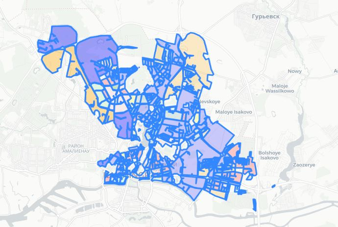
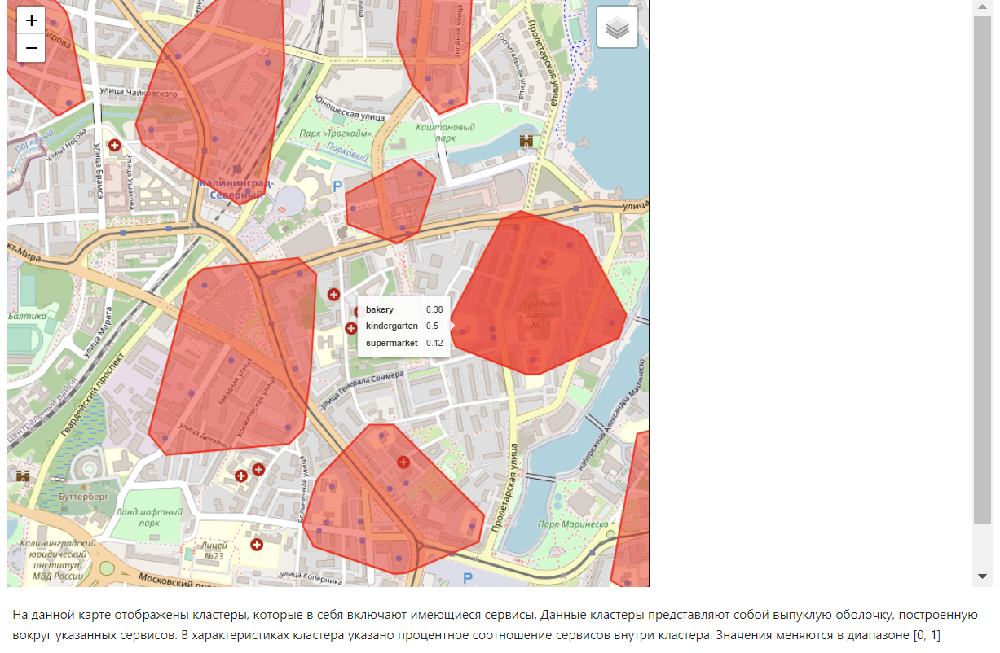

<h1>Данный репозиторий содержит проект по анализу городских данных</h1>
<h2>Авторы: Катынсус Александр, Жембровский Даниил, Шаповаленко Екатерина и Адрианова Екатерина</h2>
<h3>Содеоржание репозитория:</h3>
<ol><li>
В папке data находятся все данные по сервисам в городе Калининград
</li>
<li>
Файлы building.geojson, buildings.geojson содержат исходные данные о зданиях в городе Калининград
</li>
<li>
Файлы geocoded_buildings_partN.geojson содержат геокодированные точки (Координаты конвертировали в улицы латинскими буквами)
</li>
<li>Файл new_buildings содержит промежуточнные значения зданий</li>
<li>Файл full_data содержит финальный результат обработки данных</li>
<li>kaliningrad_buildings - DAG для геокодироваания зданий</li>
<li>Buildings_data_processing - ноутбук с выполненной предобработкой данных</li>
<li>yandex_parser - парсер для сбора данных о сервисах с яндекс карт</li>
<li>city_model - модель города Калининград</li>
</ol>

<h1>Визуализация города и зданий</h1>

<h1>Загрузка слоя со зданиями находится в папке notebooks в ноутбуке под названием Buildings_formatting</h1>

[Buildings_formatting.ipynb](notebooks%2FBuildings_formatting.ipynb)

<h1>Загрузка слоя с кварталами и их кластеризация находится в папке notebooks в ноутбуке под названием blocks_clusterization</h1>
<h2>Пример визуализации кластеризации кварталов в Ленинском районе города Калининград:</h2>

[blocks_clusterization.ipynb](notebooks%2Fblocks_clusterization.ipynb)

<h1>Загрузка слоя с сервисами и их кластериазция находится в папке notebooks в ноутбуке под названием services_clusterization</h1>
<h2>Пример визуализации класетризации сервисов:</h2>

[services_clusterization.ipynb](notebooks%2Fservices_clusterization.ipynb)

